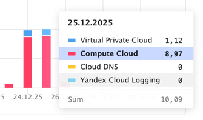

# neko-manager

Simple [telegram](https://telegram.org/) bot,
that creates [neko](https://github.com/m1k1o/neko) instances in [YC](https://yandex.cloud/en/services/compute) on demand and deletes them,
when they are not in use.

# Reasoning
My friends and I love neko, but for 4-8 people and 1920-1080-30 we need ~4 GB, 4 core server.
Having such server permanently is a bit expensive and useless, we only need it once in 2 days for 3 hours at most,
that is only 3% of whole month.

That's why I created neko-manager, it creates VM in Yandex Cloud, setups neko (even with partial TLS!), and monitor it.
If no users are present on instance, manager will delete it.

# Benefits
1. Setup speed: ~4-5 minutes from `/request` command to watching films with your friends. (Can be faster, but I didn't manage to do it)
2. Remove unused instances, if no users are present on neko, it will be deleted in 10 minutes.
3. Cheap! One 3 hours watching session cost me ~10 rubles, (~0.13 USD), which means watching films every other day would cost only 2 dollars :)

